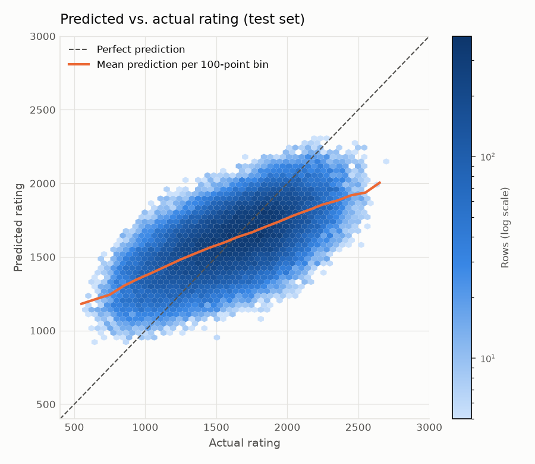

# Chess Rating Predictor

Estimate the playing strength (Lichess blitz rating) of both players **from the moves of a single game**, without looking at their real ratings.

> Final project in DAT158 Machine Learning, Western Norway University of Applied Sciences (HVL), autumn 2026.
> (The block at the top of this file is configuration for Hugging Face Spaces.)

- **Live demo:** _TODO: add the Hugging Face Spaces link after deploying (see below)_
- **Report:** [report/report.md](report/report.md)
- **AI usage log:** [report/ai_usage.md](report/ai_usage.md)

## Results at a glance

Trained on 250,000 Lichess blitz games (500,000 player rows) from September 2026; evaluated on 100,000 held-out rows. MAE = mean absolute error in rating points.

| Model | Test MAE | Test R² |
|---|---:|---:|
| Predict the mean rating (baseline) | 292 | 0.00 |
| Mean rating per time control (heuristic) | 281 | 0.07 |
| Ridge regression | 235 | 0.34 |
| Random forest | 239 | 0.32 |
| **Gradient boosting, tuned (deployed)** | **225** | **0.39** |
| Same model on players never seen in training | 225 | 0.39 |
| Gradient boosting + engine-eval features (games with `%eval` only) | 243 vs. 262 without | 0.51 vs. 0.42 |

The app shows ±225 (the test MAE); about 58% of estimates fall within it. Predictions regress toward the mean: beginners are overestimated and strong players underestimated. See the [report](report/report.md) for figures and discussion.



## How it works

```
Lichess database ──stream──▶ download.py ──▶ dataset.py ──▶ train.py ──▶ models/model.joblib
 (29 GB/month, never           filter,        features.py      compare,          │
  downloaded in full)          250k games     2 rows/game      tune, save        ▼
                                                               evaluate.py   src/predict.py ◀── app/app.py (Gradio)
                                                               (figures)     strip ratings → features → model
```

1. Rated blitz games are streamed from the [Lichess open database](https://database.lichess.org/) (CC0) and filtered; streaming stops after 250,000 games.
2. Features are computed **only** from the moves, the result and move comments (clock times) in [src/features.py](src/features.py). The same module is used for training and in the app.
3. Each game gives two rows (one per player, with own and opponent features); a regression model predicts that player's rating.
4. The web app accepts a PGN, a `.pgn` file or a Lichess game link, hides any rating headers from the model, and shows the estimate next to the true rating when it is known.

## Reproduce the results

Requires Python 3.13, ~1 GB free disk and an internet connection. Total runtime is roughly 15–25 minutes on a 16-core laptop (most of it in tuning and evaluation).

```bash
git clone https://github.com/jonkje-11/chess-rating-predictor.git
cd chess-rating-predictor
python -m venv .venv
source .venv/bin/activate          # Windows: .venv\Scripts\activate
pip install -r requirements.txt
```

All settings (month, number of games, filters, seed, tuning budget) live in [config.yaml](config.yaml). Seeds are fixed, so the same commands give the same split and models.

| Step | Make (Linux/macOS/Codespaces) | Plain Python (any OS) | Output |
|---|---|---|---|
| 1. Stream + filter games | `make data` | `python -m src.download` | `data/raw/*.parquet`, `report/filter_counts_*.json` |
| 2. Per-player features + split | `make features` | `python -m src.dataset` | `data/processed/*.parquet` |
| 3. Compare, tune, save model | `make train` | `python -m src.train` | `models/model.joblib`, `report/tables/model_comparison_*` |
| 4. Figures and tables | `make evaluate` | `python -m src.evaluate` | `report/figures/`, `report/tables/` |
| 5. EDA notebook | `make eda` | `cd notebooks && jupyter execute --inplace 01_eda.ipynb` | `notebooks/01_eda.ipynb`, `report/figures/eda_*` |
| Tests | `make test` | `python -m pytest -q` | |
| Run the app locally | `make app` | `python app/app.py` | http://127.0.0.1:7860 |

For a quick trial run, use a smaller dataset: `python -m src.download --n 20000`, `python -m src.dataset --n 20000`, `python -m src.train --n 20000 --no-tune`.

## Deploy the website (Hugging Face Spaces)

The repository is already a valid Gradio Space: the YAML block at the top of this README tells Spaces to use Gradio 6.29.1 on Python 3.13 and to run [app/app.py](app/app.py). The trained model (`models/model.joblib`, ~1 MB), the opening book and the sample games are committed, so the Space needs no training step.

1. Create a free account at https://huggingface.co and a new Space: **New → Space**, SDK **Gradio**, hardware **CPU basic (free)**, visibility **Public**.
2. Create an access token with *write* permission (Settings → Access Tokens).
3. Push this repository to the Space:
   ```bash
   git remote add space https://huggingface.co/spaces/<your-username>/chess-rating-predictor
   git push space main          # username = your HF username, password = the token
   ```
4. Wait for the build (a few minutes). The app is then live at `https://huggingface.co/spaces/<your-username>/chess-rating-predictor`.

Data files under `data/raw` and `data/processed` are git-ignored and never pushed. If you retrain, commit the new `models/model.joblib` and push to both remotes.

## Data leakage

PGN headers contain the answer (`WhiteElo`, `BlackElo`, rating diffs, titles, player names, game URL). Protection is layered:

- `src/features.py` can only read an allow-list of four headers (`Result`, `TimeControl`, `ECO`, `Termination`); any other header access raises an error.
- The app strips rating/identity headers in the backend ([src/pgn_utils.py](src/pgn_utils.py)) before features are computed, and only uses them afterwards to show the true rating.
- Tests prove that features and predictions are identical when rating headers are removed or changed ([tests/test_features.py](tests/test_features.py), [tests/test_predict.py](tests/test_predict.py)).
- Usernames are kept in the dataset only to group an "unseen players" evaluation; they are never model inputs.

## Project structure

```
src/
  download.py     stream + filter games from Lichess
  pgn_utils.py    strip rating headers, parse/validate PGN, Lichess game IDs
  features.py     feature extraction shared by training and the app (set A; set B = engine evals)
  dataset.py      two rows per game, grouped train/test split
  train.py        baseline, Ridge, Random Forest, HistGradientBoosting; tuning; save best
  evaluate.py     figures and tables for the report
  predict.py      prediction backend for the app (JSON in/out, UI-independent)
app/app.py        Gradio UI (custom theme/CSS)
tests/            unit + leakage + end-to-end tests
notebooks/        exploratory data analysis
models/           trained model (committed)
report/           report, figures, tables, AI usage log
data/sample/      40 sample games (committed); data/openings/ = Lichess opening book (CC0)
```

## Data, licences and credits

- Game data: [Lichess open database](https://database.lichess.org/), CC0.
- Opening names/ECO codes: [lichess-org/chess-openings](https://github.com/lichess-org/chess-openings), CC0.
- Built with scikit-learn, python-chess, pandas, Gradio. AI assistance (Claude Code) is documented in [report/ai_usage.md](report/ai_usage.md).
- Code licence: MIT (see [LICENSE](LICENSE)).
