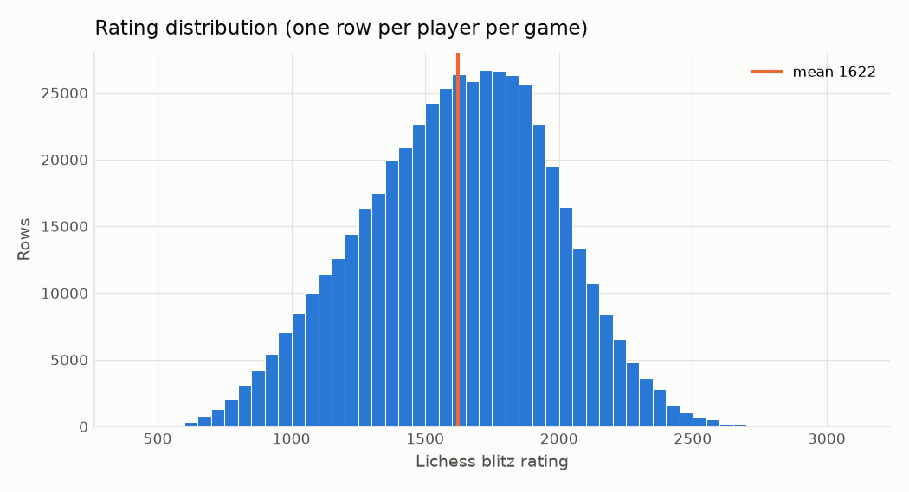
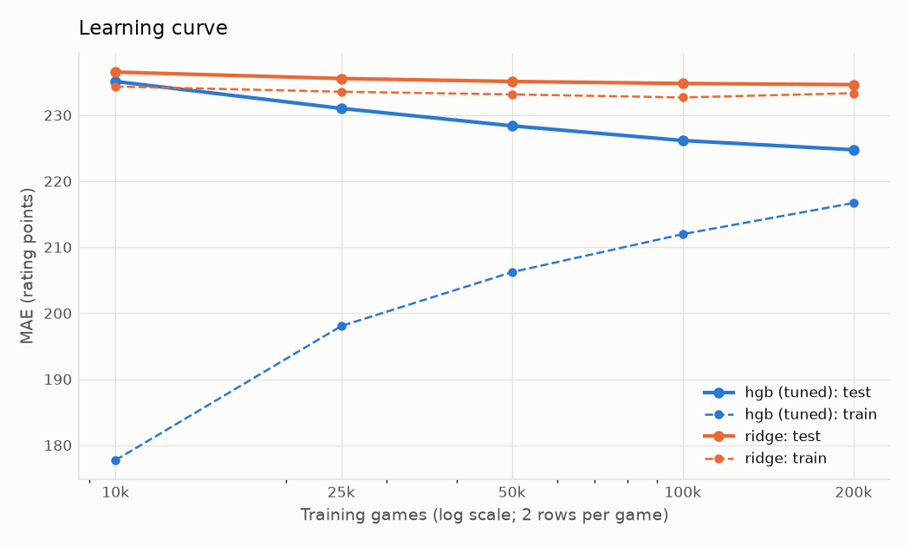
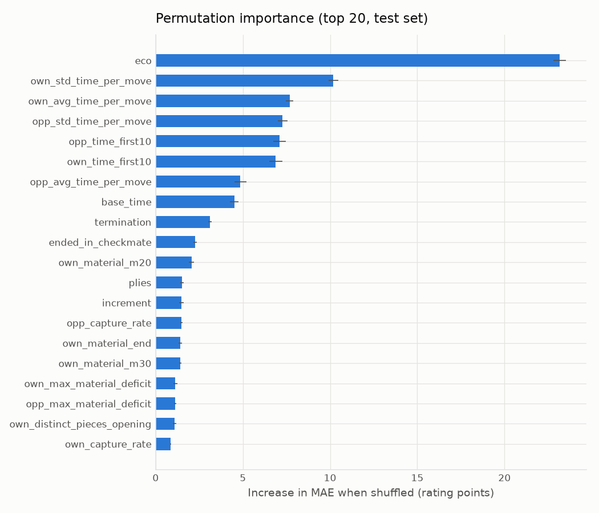
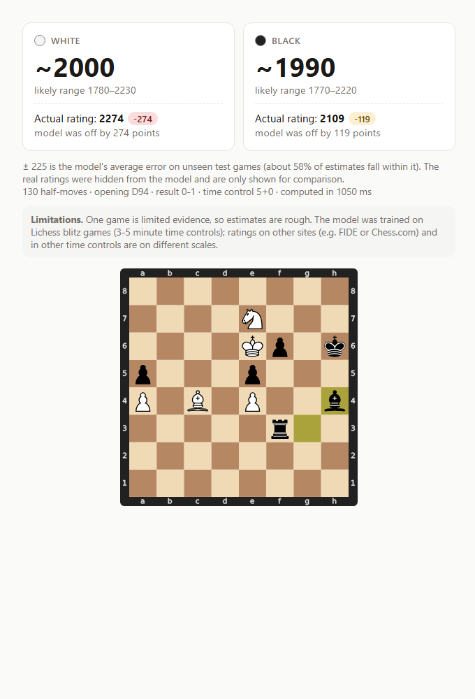

# Chess Rating Predictor: estimating playing strength from a single game

**Jonas** _(TODO: full name)_, 30 October 2026. DAT158 Machine Learning, assignment 2 (project work), HVL.

Repository: https://github.com/jonkje-11/chess-rating-predictor · Live app: _TODO: Hugging Face Spaces link_

---

## 1: Describe the problem

### Scope

**Goal.** Build a website where a user submits one chess game (PGN text, a `.pgn` file or a Lichess link), and a machine-learning model estimates the rating of both players **from the game itself**, without seeing their real ratings. Example output: *White ~1650 (±225), Black ~1480 (±225)*. If the input contains the real ratings, they are hidden from the model and shown afterwards for comparison.

**Users.** Players who want a strength estimate for an unrated game (casual over-the-board games, games on other sites), coaches assessing an unknown student, and curious players. The estimate is an indication, not an official rating.

**Existing solutions.** Official ratings (Elo, Glicko-2) use only *results* over many games, never the content of a game. Without ML, experienced players and coaches judge strength by eye from opening knowledge, blunders and time use; this needs expertise and is subjective. Related products and research:

- **Chess.com Game Review** shows an estimated rating for one game, derived from engine accuracy (mistakes, centipawn loss). It is proprietary, needs a full engine analysis and only works inside Chess.com (Chess.com, n.d.).
- **"Guess the Elo" games** (e.g. *Guess The Elo* on itch.io, built on Lichess games) turn the same task into a quiz for humans, showing the demand for it but offering no automatic estimate.
- **Research.** The Kaggle competition *Finding Elo* (Kaggle, n.d.) posed this exact task. Tijhuis et al. (2023) classified rating brackets from 30 hand-crafted features of a single game (79.3% accuracy for the extreme brackets). Omori and Tadepalli (2024) trained a CNN-LSTM on moves and clock times of over one million Lichess games and report an MAE of 182 rating points. Maia (McIlroy-Young et al., 2020) shows that move choices differ systematically between skill levels.

Our niche is a free, open and explainable tool that works on any PGN without an engine, using classical models from the course. The published deep-learning result (182) is a useful reference point, although it is not directly comparable: it uses different data, several time controls and a far larger model.

**Why machine learning.** The signal is spread over many weak indicators (time use, opening choice, material swings) that are hard to combine by hand-written rules, while millions of labelled games are freely available: a textbook supervised regression setting.

**"Business" objective.** A credible free estimate that users find useful: usually within about ±200–250 points, and never wildly off for typical players. It also has an educational purpose: showing what one game can and cannot reveal.

**System components.** A pipeline: download → features → dataset/split → train/evaluate → prediction backend + web app. Changes propagate: a new filter changes the training distribution, and a feature change requires rebuilding the dataset, retraining *and* identical feature code in the app. That is why one module (`features.py`) is shared by training and the app.

**Resources.** One student, a laptop (16 cores, no GPU), roughly one to two weeks of work, free hosting and free CC0 data. No paid compute was needed.

**Framing alternatives.** Rating could also be framed as *classification* into rating brackets (as in Tijhuis et al., 2023). We chose **regression**, because ratings are ordered and continuous, a bracket model treats "off by one bracket" and "off by four" as equally wrong, and a regression estimate with an error margin is more informative for users.

### Metrics

- **ML metrics.** Mean absolute error (MAE) in rating points is primary: it is directly interpretable ("off by 225 points on average") and is shown as ± in the app. RMSE (penalises large misses) and R² are reported alongside.
- **Software metrics.** Prediction latency (target: well under one second on free CPU hosting) and model file size (small enough to commit).
- **Minimal success criterion.** The model must clearly beat the `DummyRegressor` baseline that predicts the mean rating; we set the bar at **at least 15% lower test MAE** than the baseline, measured on games and (separately) on players the model has never seen. _(TODO: confirm this threshold is the one you want to state.)_

## 2: Data

**Source and licence.** Games come from the Lichess open database (Lichess, 2026a), monthly files of all rated standard games, released under CC0. We use **September 2026**. A month is about 29 GB compressed (~90 million games), so the file is **never downloaded**: `download.py` streams it over HTTP, decompresses with `zstandard` on the fly, filters on header text, and stops after 250,000 kept games (about 180 MB transferred, 93 seconds).

**Data needed and wanted.** The minimum is many games with both the full move list and both players' ratings, from one rating pool and one time control (ratings differ between sites and time controls). Desirable extras were clock times (time use is a strong skill signal), engine evaluations, a recent period (current rating pool) and a licence that allows publishing a derived model and sample data.

**Sources considered:**

| Source | Pros | Cons |
|---|---|---|
| **Lichess open database** (chosen) | Every rated game; CC0 licence; clock times; ~10% with engine evals; monthly updates | Very large files (solved by streaming) |
| Chess.com Published-Data API | Large player base | Only per-player monthly archives (sampling would be biased toward chosen players and slow); IP/branding restrictions (Chess.com, n.d.) |
| Kaggle "Chess Game Dataset (Lichess)" | Ready-made, CC0 | Only ~20,000 games from selected users; no clock times; mixed time controls |
| Over-the-board databases (e.g. FIDE events) | Official FIDE ratings | Mostly titled/strong players (narrow rating range); no clock data; unclear licences |

The Lichess database meets every requirement and the licence permits everything we need.

**Labels.** The target is each player's Lichess **blitz rating** at the time of the game (`WhiteElo`/`BlackElo` headers). Lichess uses Glicko-2: new players start at 1500 with high uncertainty, and ratings are provisional while the rating deviation exceeds 110 (Lichess, 2026b). Labels are therefore noisy (a new account can be hundreds of points from its true strength), which puts a floor under any achievable error.

**Filtering** (counts logged by `download.py`):

| Step | Games | Share of streamed |
|---|---:|---:|
| Streamed from the start of the file | 562,581 | 100% |
| Removed: not blitz (bullet, rapid, classical, …) | 302,489 | 53.8% |
| Removed: shorter than 20 plies | 8,686 | 1.5% |
| Removed: abandoned / rules infraction | 709 | 0.1% |
| Removed: base time outside 180–300 s | 697 | 0.1% |
| **Kept** | **250,000** | 44.4% |

**Dataset.** Each game gives **two rows**, one per player, with the player's own features (`own_*`), the opponent's features (`opp_*`), game-level features and a `color` flag: 500,000 rows, 58 features. One model therefore serves both colours. EDA (`notebooks/01_eda.ipynb`) shows:

- Ratings have mean 1622 and standard deviation 360 (range 400–3060).
- **Lichess pairs players of similar strength**: White and Black ratings correlate at 0.95 (median difference 30 points). The opponent's play therefore carries information about a player's own rating, which is why opponent features are included.
- **Time control is self-selected and informative**: mean rating 1713 in 3+0 versus 1439 in 5+3.
- **Stronger players move faster in the opening**: median time on the first 10 moves falls from 42 s (<1000) to 17 s (2000+).
- All games have clock annotations (`%clk`); only 9.8% have engine evaluations (`%eval`).

**Feature engineering** (`src/features.py`, feature set A). Features are computed by replaying the moves with `python-chess`:

- **Result:** result from the player's perspective and checkmate given or received.
- **Move statistics:** captures, checks and promotions (counts and rates); castling (side and move number); queen moves and number of distinct pieces moved in the first 10 moves.
- **Material balance:** balance at moves 20, 30 and 40 and at the end; the largest material deficit, and the largest deficit the player recovered from.
- **Clock use:** mean and standard deviation of time per move, time used on the first 10 moves, remaining time as a fraction of the base time, and share of moves made with under 10 s left.
- **Time control and termination:** base time, increment and termination type.
- **Opening:** the ECO code, taken from the header or derived from the moves with the Lichess opening book (Lichess, 2026c).

Missing values are natural: material at move 40 is missing in 67% of rows because the game ended earlier. Tree models handle NaN natively; for Ridge, missing values are median-imputed with indicator columns, numeric features are standardised and categoricals one-hot encoded, all inside scikit-learn `Pipeline`s, so preprocessing is saved with the model.

**Leakage prevention.** PGN headers contain the answer (`WhiteElo`, `BlackElo`, rating changes, titles, usernames, game URL). Protection is layered:

1. Feature code can only read an allow-list of four headers (`Result`, `TimeControl`, `ECO`, `Termination`), and any other access raises an error.
2. The app strips rating and identity headers **in the backend** before computing features.
3. Unit tests show that features and predictions are identical when rating headers are removed, or changed to other values, for all 40 committed sample games.
4. The train/test split is **grouped by game**, so the two rows of one game never end up on different sides. Otherwise a test row's opponent features would have been seen as own features in training.

**Privacy and ethics.** The data is public and CC0, but usernames identify real people. They are used only to group the "unseen players" evaluation and are never model inputs. The app has no database and does not keep submitted games (uploads only pass through Gradio's temporary file cache). A rating estimate from one game could be misused to judge people. The app therefore shows the uncertainty and a limitations note with every estimate.

**Limitations of the sample.** The file is chronological, so the 250,000 games all come from **1 September 2026, 00:00–07:15 UTC** (night in Europe, evening in the Americas). The player population at that hour may differ from the full month, and the model is restricted to Lichess blitz.

## 3: Modeling

**Split and selection protocol.** 80/20 train/test split grouped by game (400,000 / 100,000 rows). Models are compared on a grouped **validation** split (10% of the training games); the test set is used only to report final numbers. The best model is then tuned with grouped cross-validation on the training set and refit on the full training set.

**Models.** In order of complexity:

1. `DummyRegressor` (training mean)
2. Ridge regression
3. Random forest (100 trees, min. 20 samples per leaf)
4. `HistGradientBoostingRegressor` (HGB), with native categorical support and early stopping

These cover the course's progression from a regularised linear model to bagging and boosting ensembles.

**Baselines.** Besides the mean predictor, a non-ML heuristic predicts the mean training rating of the game's time control. It reaches MAE 281.4 (R² 0.07), only slightly better than the mean, which shows that the features below add far more than the time-control choice alone. No published human-level benchmark for this task was found, so human performance is not estimated.

**Results** (test set, 100,000 rows):

| Model | Validation MAE | Test MAE | Test RMSE | Test R² | Train MAE | Size |
|---|---:|---:|---:|---:|---:|---:|
| Mean baseline (Dummy) | 289.1 | 292.1 | 361.0 | 0.00 | 291.5 | 0 MB |
| Mean per time control (heuristic) | – | 281.4 | 348.2 | 0.07 | – | – |
| Ridge | 232.4 | 234.7 | 293.9 | 0.34 | 233.4 | 0.02 MB |
| Random forest | 236.9 | 238.7 | 297.7 | 0.32 | 219.5 | 78 MB |
| HGB (defaults) | 223.2 | 224.7 | 282.2 | 0.39 | 209.1 | 1.7 MB |
| **HGB tuned, refit on all training data (deployed)** | – | **224.8** | **282.1** | **0.39** | 216.7 | 1.4 MB |

HGB is best on validation and reduces MAE by **23%** relative to the mean baseline, which meets the success criterion. The random forest overfits more (largest train/test gap), is the weakest ensemble and is 78 MB, too large to deploy comfortably. Ridge is surprisingly close, so most of the signal is roughly additive.

**Hyperparameter search.** We ran a random search (course module 2: random rather than grid search, to cover more values per parameter with a small budget):

- **Budget:** 12 candidates × 3-fold grouped CV on 100,000 training games, about 5 minutes in total.
- **Parameters:** learning rate, number of iterations, number of leaves, minimum leaf size and L2 regularisation.

CV MAE varied only between 226.1 and 235.6 across the candidates. The best setting has few leaves (16) and strong L2 regularisation (4.3), i.e. a *simpler* model. It matches the default model's test MAE (224.8 vs. 224.7) with less overfitting (train MAE 216.7 vs. 209.1) and a smaller file. We deploy it for that reason. In bias–variance terms, the remaining error is mostly **bias / irreducible noise**, not variance, so more tuning has little to gain.

**Learning curve.** Tuned HGB and Ridge were trained on 10k–200k training games (200k = all) and evaluated on the same test set. HGB improves from MAE 235.1 (10k) to 228.4 (50k) and 224.8 (200k); each doubling now gains only 1.5–2.5 points, and the train–test gap shrinks from 57 to 8 points, so the model is no longer variance-limited. Ridge is flat at about 235 with train error equal to test error: a high-bias model. This justifies 250k games instead of 90 million: more data buys a few points, while better *information per game* (set B below) buys much more.

**Generalisation to unseen players.** In the main split, 89.8% of test rows belong to players with other games in training, so a player's style could be memorised indirectly. We therefore held out 20% of usernames entirely (320,312 training rows without any of their games; 99,841 test rows of those players). MAE is **224.8** (R² 0.39), the same as on the standard split: the model generalises to new players.

**Error analysis.** Error depends strongly on the true rating and shows clear **regression toward the mean**:

| True rating | Rows | MAE | Mean prediction | Bias |
|---|---:|---:|---:|---:|
| < 1000 | 5,040 | 437 | 1314 | +437 |
| 1000–1499 | 30,659 | 232 | 1498 | +204 |
| 1500–1999 | 49,716 | 163 | 1667 | −75 |
| 2000+ | 14,585 | 346 | 1825 | −341 |

When the evidence is weak, the MAE-minimising answer is close to the population mean, so beginners are overestimated and strong players underestimated. Error falls with game length, from MAE 243 for games under 40 plies to 213–216 for games over 100 plies, because longer games carry more evidence. Possible improvements are a model that sees several games per player, sample weighting of rare rating ranges, or reporting a quantile interval that widens at the extremes.

**Feature importance.** Permutation importance on 20,000 test rows (increase in MAE when one feature is shuffled):

- The opening code (`eco`, +23 points) is the strongest single feature, because opening choice reflects knowledge.
- Clock features follow: the player's variability of time per move (+10), mean time per move (+8) and time used on the first 10 moves (+7), for both the player and the opponent. Base time (+4.5) captures the self-selection seen in the EDA.
- Material and move statistics matter less individually.
- Because own and opponent features are correlated, permutation importance *understates* each of them (shuffling one leaves its partner intact). Features with zero importance, such as `eco_group` and `castled`, are redundant given `eco` and `castle_move`, not useless.

**Engine features (set B).** About 10% of games carry engine evaluations. On these games we computed average centipawn loss (overall, first 15 moves and later) and counts of inaccuracies, mistakes and blunders. The thresholds are a loss of at least 50, 100 and 300 centipawns per move, with evaluations capped at ±1000. Both models were trained with the tuned HGB settings on the same grouped split, restricted to games with evaluations (39,150 training rows, 9,760 test rows):

| Model (test rows with engine evals) | Test MAE | RMSE | R² |
|---|---:|---:|---:|
| Deployed model (set A, trained on all 400k rows) | 260.5 | 322.7 | 0.44 |
| Set A, trained on eval subset | 262.4 | 326.8 | 0.42 |
| **Set A+B, trained on eval subset** | **242.7** | **301.5** | **0.51** |

Engine features lower MAE by about 20 points (7.5%) at equal training size and raise R² from 0.42 to 0.51: move *quality* carries information that clocks and material cannot. (Errors are higher on this subset than overall because games that were analysed by an engine have a wider rating spread.) The deployed app still uses set A, because most submitted games have no evaluations and computing them would require running Stockfish on the server, but this is the most promising improvement.

**Limitations.** One game is limited evidence; labels are noisy; the sample covers seven hours of one day; and the model only knows Lichess blitz, so ratings from other sites or time controls are on different scales.

## 4: Deployment

**Architecture.**
- **App:** a web app with a custom theme, hosted for free. _(TODO: update after moving the UI to Streamlit Community Cloud; Hugging Face now requires a paid plan for Gradio Spaces.)_
- **Inputs:** three tabs for pasting a PGN, uploading a file, or giving a Lichess URL/ID. For a link, the game is fetched from the Lichess export API (`/game/export/{id}?clocks=true`), with clear messages for unknown games, rate limiting (HTTP 429) and network errors.
- **Separation:** all ML logic is in `src/predict.py` (`predict_pgn(pgn) -> dict`, plain JSON data); the UI only formats the output, so it can be replaced without touching the model.

**What happens on a request.**
1. Strip rating and identity headers, keeping the true values aside.
2. Validate the game (standard chess, legal moves, at least 20 plies).
3. Compute features with the same `features.py` used in training.
4. Predict both rows with the saved pipeline and clip to the 400–3100 range seen in training.
5. Show the estimates, the final position and, if available, the true ratings with the error.

The **± interval is the test-set MAE** (225 points) rather than a guessed number; the app states that about 58% of test estimates fall within it. The model file is 0.6 MB, and latency on the 40 sample games is 25 ms median (35 ms max) on a laptop CPU, well within the software target. Three example games (low, mid and high rated) from the committed sample make the demo usable in one click.

**Monitoring and maintenance.** The Lichess rating pool drifts over time: rating inflation or deflation, new players, and changes in popular openings and time controls. Monitoring would track:
- the distribution of predictions and of input features (e.g. share of games without clocks, unknown ECO codes);
- whenever true ratings are available in the input, the live MAE against the true ratings, which is a free source of labelled feedback.

Retraining on a newer month is four commands; pinned versions and fixed seeds make it reproducible.

**Planned improvements.**
- A quantile model for honest, rating-dependent intervals.
- Engine features in the app (running Stockfish server-side), as set B showed a clear gain.
- Sampling games across the whole month instead of the first hours.
- Supporting other time controls with separate models.

## 5: References

- Géron, A. (2022). *Hands-On Machine Learning with Scikit-Learn, Keras, and TensorFlow* (3rd ed.). O'Reilly. Chapter 2 and Appendix A (Machine Learning Project Checklist).
- Chess.com (n.d.). *How does Game Review work?* https://support.chess.com/article/364-how-does-the-game-report-analysis-work · *Published-Data API*. https://support.chess.com/en/articles/9650547-published-data-api
- hieuimba (n.d.). *Guess The Elo* [game]. https://hieuimba.itch.io/guess-the-elo
- Kaggle (n.d.). *Finding Elo* [competition]. https://www.kaggle.com/c/finding-elo · datasnaek (n.d.). *Chess Game Dataset (Lichess)*. https://www.kaggle.com/datasnaek/chess
- Lichess (2026a). *Lichess open database* (CC0). https://database.lichess.org/
- Lichess (2026b). *Frequently asked questions: ratings (Glicko-2, provisional ratings)*. https://lichess.org/faq
- Lichess (2026c). *chess-openings* (CC0). https://github.com/lichess-org/chess-openings
- McIlroy-Young, R., Sen, S., Kleinberg, J., & Anderson, A. (2020). Aligning superhuman AI with human behavior: chess as a model system. *Proceedings of KDD '20*. https://arxiv.org/abs/2006.01855
- Omori, M., & Tadepalli, P. (2024). Chess rating estimation from moves and clock times using a CNN-LSTM. *Computers and Games (CG 2024)*. https://arxiv.org/abs/2409.11506
- Tijhuis, T., Mavromoustakos Blom, P., & Spronck, P. (2023). Predicting chess player rating based on a single game. *IEEE Conference on Games (CoG)*.
- Pedregosa, F. et al. (2011). Scikit-learn: Machine learning in Python. *JMLR* 12, 2825–2830.
- Fiekas, N. *python-chess*. https://github.com/niklasf/python-chess
- Gradio (2026). https://www.gradio.app/ · Hugging Face Spaces. https://huggingface.co/spaces

**AI usage statement.** Claude Code (Anthropic, Claude Opus 5.5) was used as a coding assistant under the student's direction: it wrote most of the code, tests and figures, proposed design choices that the student decided on, and drafted this report from the actual script outputs. A dated log is in `report/ai_usage.md`; all numbers can be reproduced with the commands in the README.
